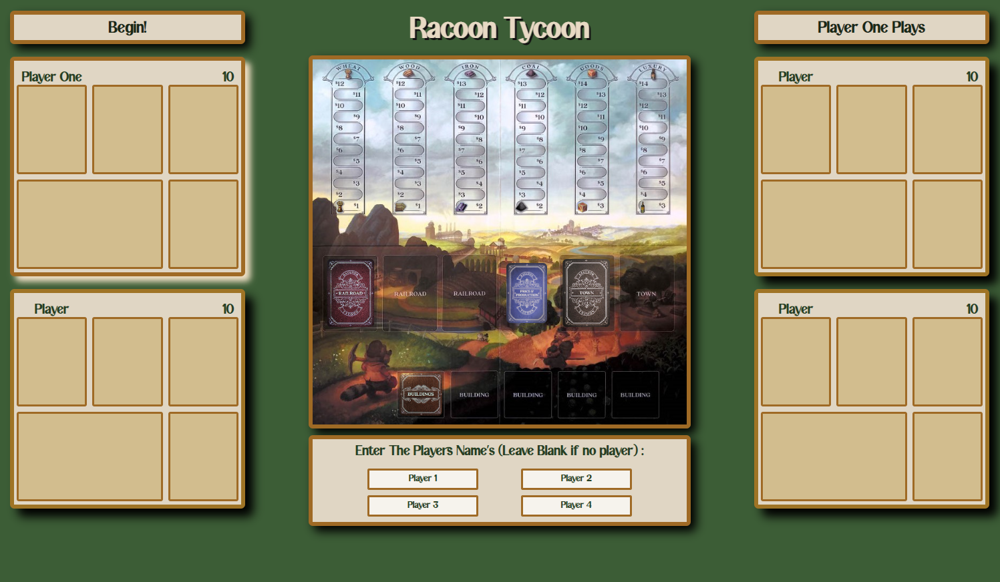

# **Racoon Tycoon**

### Carl Menke

### 8/18/2022

#### [GitHub](https://github.com/carlmenke) | [LinkedIn](https://www.linkedin.com/in/carl-menke-333226139/) | [Deployed](general-drawer.surge.sh)

---

A JavaScript Racoon Tycoon Clone

---

## **_Description_**

This is a browser-based Racoon Tycoon Program written in JavaScript which I coded three weeks after being introduced to HTML, CSS, and JavaScript.

---

## **_Screenshots_**

Final Game Board Screenshot:

---

## **_Technologies_**

- JavaScript
- CSS
- HTML

---

## **_Roadmap (Future Updates)_**

- ~~Write JS OOP to create all the cards and players~~
- ~~Write JS for all turn functions~~
- ~~Add a ocnfirm button instead of the current alert~~
- ~~Add logic for all buildings~~
- ~~Make the players commodies organized~~
- Make it so that all the cards move when changes places
- Make it so that everyone gets the same amount of turns
- Sdd a frequently asked questions to clairify somethings

---

## **_Getting Started_**

[Play Here](https://general-drawer.surge.sh/)

1. Enter All the names of the people playing
2. Player one is up first
3. On your turn you can do 5 things, all displayed on the page
   - Purchase a buildings
   - Purchase a town
   - Purchase a Rail Road
   - Produce commodies.
   - Sell Commodies
4. Play until the Rail Road deck or Town deck is empty.
5. The player with the most victory points at the end of the game wins!

---

## **_Credits_**

**Racoon Tycoon Image:** [DuckDuckGo](https://duckduckgo.com/?t=hc&va=b)

**Racoon Tycoon Game Logic and Nomenclature:** [Glenn Drover](https://www.forbiddengames.net)

**Logo Designed Using:** [Canva](https://www.canva.com/)
